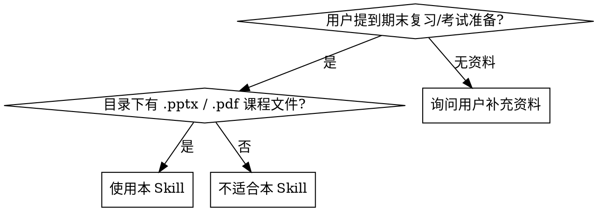

# 期末复习 Skill

## 概述

把用户上传的课程资料（PPT、PDF、课本、真题、作业、笔记）整理成**偏考试得分导向**的复习笔记、题目和解析。

核心哲学：**规则驱动 AI 行为 + 脚本加速重复劳动**。规则告诉 AI Agent 怎么思考、怎么出题、怎么写解析；脚本处理 PDF 排版、思维导图生成、模拟卷组卷等机械性任务。

## 何时使用



**适用场景：**
- 用户有课程 PPT、课本 PDF、习题答案，需要整理成复习资料
- 用户需要按真实考试题型生成练习题和模拟卷
- 用户需要带解析的题目（解析要讲"怎么拿分"而不只是"为什么对"）
- 用户需要生成思维导图、知识点清单、易错点总结
- 用户需要专业排版的 PDF 复习文档

**不适用场景：**
- 通用学习笔记（非考试导向）
- 单文件格式转换（直接用 markitdown）
- 学术论文整理（用 academic-paper skill）
- 用户没有课程资料，只需要泛泛的知识讲解

## 核心规则（AI 行为约束）

以下规则是 AI Agent 在处理期末复习任务时**必须遵守**的行为准则。这些不是建议，是工作协议。

### 1. 题源优先级

出题和判断重点时，按以下顺序优先取材，**不可平均分配**：

| 优先级 | 题源 | 说明 |
|--------|------|------|
| 1（最高） | 历年真题 | 最贴近真实考试，优先复用 |
| 2 | 老师 PPT | 课堂重点，考试范围的主要依据 |
| 3 | 平时作业 / 阅读作业 | 老师出题偏好的直接体现 |
| 4 | 速成课题目 | 优先级较低，但知识点梳理价值高 |
| 5（最低） | AI 补充题 | 仅在已有材料不足时使用 |

**速成课定位：** 虽然题目优先级低，但在以下方面价值高：
- 提炼核心知识点
- 搭建复习框架和结构
- 总结重点、易错点、常考点
- 辅助判断哪些内容更值得重点复习

### 2. 材料处理规则

```
转 Markdown → 清洗 → 提知识点 → 出题
```

**顺序不可颠倒。** 先转格式，再清洗去噪，再提取知识点，最后出题。

- 所有上传材料先统一转成 Markdown
- 默认使用 `markitdown` 工具转换（PPT、PDF、Word、图片）
- 清洗重点：去乱码、去重复、去低价值废话，保留核心定义、性质、定理、标准方法、常见考法、易错点
- 目标不是"完整存档"，而是"清晰、可背、可考"

**多引擎提取策略（处理复杂 PDF / 扫描件）：**

| 文件类型 | 推荐引擎 | 原因 |
|----------|----------|------|
| .pptx | markitdown | 保留表格、格式、幻灯片结构 |
| .docx | markitdown | 处理编码、表格、批注 |
| PDF（文本型） | liteparse | 处理 CMap 编码（PyMuPDF 会乱码） |
| PDF（扫描件） | liteparse OCR | 保留边界框的 OCR，页面截图 |
| 图片 (.png/.jpg) | liteparse OCR | 复习范围截图等 |
| .txt/.md | 直接读取 | 无需转换 |

```bash
# 安装依赖（一次性）
python3 -m pip install "markitdown[all]" liteparse pymupdf python-docx
```

### 3. 出题规则

- 先明确本课程会考哪些题型，再按题型出题，**不做平均分配**
- 每个知识点通常出 `1~6` 题
- 知识点越密、越高频、考法越多 → 题量越多
- 知识点越薄、越低频 → 题量越少
- 题型要**匹配知识点最可能考法**：

| 知识点类型 | 匹配题型 |
|------------|----------|
| 识记辨析型 | 选择、判断、填空 |
| 定义比较型 | 简答 |
| 推理证明构造型 | 证明题、计算题、分析题 |

### 4. 题源标记规则

每道题保留轻量**类别级**题源标记。默认不要求精确追踪到文件级、页码级（除非用户明确要求）。

```
题源：历年真题
题源：老师PPT
题源：平时作业
题源：速成课框架改编
题源：AI补充
题源：综合改编（历年真题 + PPT）
```

**高级溯源模式（可选）：** 当用户要求精确追踪时，升级为：
```markdown
> Source: PPT-Ch1-Slide7 | Textbook P3-4 | Exercise Q3, Q14
```

**答案可信度标记（高级模式）：**

| 级别 | 标记 | 规则 |
|------|------|------|
| 已确认 | （无标记） | 习题答案与 PPT + 课本内容一致 |
| 单源 | `[*]` | 仅有习题答案，无 PPT/课本直接确认 |
| 存疑 | `[!]` | 习题答案与 PPT 或课本冲突 → 课本为准 |

### 5. 输出规则

**普通文本 / Markdown 输出：**
- 前面只放题目
- 所有答案统一放最后
- 题目区和答案区**明确分开**

**HTML 输出：**
- 答案放在题目下面
- 答案默认折叠隐藏（`<details>` 标签）
- 用户点击后再展开答案和解析

### 6. 解析规则

每道题解析**不只解释对错，还要服务考试拿分**。尽量包含：
- 正确答案 / 参考答案
- 本题考哪个知识点
- 这类题的常见考法
- 考试时如何尽可能拿分

**客观题（选择、判断、填空）重点补：**
- `这题核心知识点`
- 关键定义 / 性质 / 判定依据
- 易混点

**主观题（简答、证明、分析、计算）重点补：**
- `这题答题核心点`
- `必须出现`（哪些关键词/步骤必须写）
- `常见失分点`
- 标准作答框架

### 7. 得分导向规则

解析必须服务考试得分，**不写空话**。优先补：
- 看到这类题先写什么
- 哪些关键词必须出现
- 哪些步骤能抢步骤分
- 哪些错误最容易丢分

**可执行的得分技巧（示例）：**
- 看到判断题 → 先看边界条件和反例
- 看到简答题 → 先写定义，再写性质，再写结论
- 看到证明题 → 先写已知、求证和入口定理/定义
- 不会完整作答时 → 先写核心定义、关键性质、结论，先抢步骤分

---

## 自动化管线（可选增强）

当资料量大、需要专业排版或批量处理时，使用以下脚本管线。

### 管线概览

```
Phase 0: SCAN    →  检测考试结构（题型、章节分布）
Phase 1: EXTRACT →  多引擎资料提取（PPT + PDF + DOCX → 结构化文本）
Phase 2: FUSE    →  知识点融合 + 思维导图生成 + 内容分类
Phase 2.5: REVIEW → 质量审查（Critic 评分 → Reviser 修正，≥80/100 通过）
Phase 3: OUTPUT  →  生成复习文档（MD + PDF）+ 可选模拟卷
```

### Phase 0: 考试结构检测

```bash
python3 scripts/scanner.py "<课程资料目录>"
```

输出 `config/exam-format.yaml` 和结构摘要表。

**在进入 Phase 1 前，必须与用户确认：**
1. "这个考试结构对吗？"
2. "有没有需要优先复习或跳过的章节？"

### Phase 1: 多引擎资料提取

```bash
python3 scripts/extract_all.py "<课程资料目录>"
```

将所有资料转为 `__extracted__/chN.txt` 格式的结构化文本。

### Phase 2: 知识融合

```bash
python3 scripts/fuse_knowledge.py "<课程资料目录>"
```

融合规则：
1. 题纲是骨架 — 最终文档的每章对应题纲的一个主题
2. PPT 填充概念 — 幻灯片内容填充定义、机制、图表
3. 课本确认细节 — OCR 的课本内容验证和补充
4. 习题映射到知识点 — 每道题打标到对应概念

**内容分类（语义理解，非关键词匹配）：**

| 类型 | 用于… | PDF 样式 |
|------|-------|----------|
| 定义 | 解释概念是什么 | 蓝色边框框 |
| 理论 | 命名理论/模型/条件/规则 | 深红边框框 |
| 公式 | 计算方法或数学表达式 | 绿色边框框 |
| 易错 | 习题错误数据确认的常见错误 | 粉色边框框 |
| 关联 | 跨章节概念链接 | 灰色虚线框 |

| 优先级 | 依据 |
|--------|------|
| Critical | 题纲标 ★★★ 或"重中之重" |
| Key | 题纲有页码引用 + ≥2 道习题 |
| Standard | PPT 中存在但未被上述标记 |

**思维导图生成：**
```bash
python3 scripts/generate_mindmap.py <章节文件>
```

输出 Mermaid 格式的思维导图，便于嵌入 MD 文档或独立渲染。

### Phase 2.5: 质量审查（Critic + Reviser）

```
融合后的 MD → Critic 逐章评分 → 分数 ≥ 80？ → 是 → Phase 3
                                    → 否 → Reviser 重写 → 回到 Critic
```

**Critic 评分标准（每章，满分 100）：**

| 维度 | 权重 | 检查内容 |
|------|:----:|----------|
| 题纲覆盖 | 40% | ★★★ 或页码引用的每题纲主题都有覆盖。章节题目分布匹配题纲。 |
| 答案准确 | 30% | 习题答案与 PPT、课本交叉验证。存疑答案标记 `[!]`。单源答案标记 `[*]`。 |
| 结构完整 | 20% | 章节包含四要素：概念 → 重点 → 习题 → 易错。有思维导图。有题源标记。 |
| 可读性 | 10% | 术语正确。表格前有空行。无 Markdown 语法错误。 |

- 90-100：通过，无需修改
- 80-89：小问题，内联修复即可
- 60-79：显著缺口，仅该章送 Reviser
- <60：重大重写，标记用户审查

**最多 2 轮修订**。如果 2 轮后仍 < 80，标记给用户并列出具体问题。

### Phase 3: 输出生成

```bash
# 生成 MD + PDF 复习文档
bash scripts/build.sh "<课程资料目录>" "<输出文件名>"

# 可选：生成模拟卷
python3 scripts/generate_mock.py "<课程资料目录>" \
  --difficulty mixed \
  --chapters all \
  --output mock_exam
```

**模拟卷配置选项：**
- `--difficulty`: basic | medium | mixed | advanced
- `--chapters`: all | weak（用户指定的薄弱章节）| custom
- `--types`: all | objective-only | subjective-only
- `--source`: real-only | mixed | new-only
- `--count`: full | half | custom=N

**PDF 生成前提：**
```bash
winget install JohnMacFarlane.Pandoc
winget install MiKTeX.MiKTeX
initexmf --set-config-value "[MPM]AutoInstall=1"  # 避免弹窗
```

---

## 快速参考

| 任务 | 命令 |
|------|------|
| 检测考试结构 | `python3 scripts/scanner.py "<dir>"` |
| 提取所有资料 | `python3 scripts/extract_all.py "<dir>"` |
| 融合为复习文档 | `python3 scripts/fuse_knowledge.py "<dir>"` |
| 生成思维导图 | `python3 scripts/generate_mindmap.py "<file>"` |
| 构建最终 PDF | `bash scripts/build.sh "<dir>" "<name>"` |
| 生成模拟卷 | `python3 scripts/generate_mock.py "<dir>"` |
| 检查依赖 | `python3 scripts/check_deps.py` |

## 工具清单

| 工具 | 安装方式 | 用途 |
|------|----------|------|
| markitdown | `pip install "markitdown[all]"` | PPTX/DOCX → Markdown |
| liteparse | `pip install liteparse` | PDF OCR + 文本提取 |
| PyMuPDF | `pip install pymupdf` | PDF 页面渲染 |
| python-docx | `pip install python-docx` | DOCX 后备方案 |
| Pandoc | `winget install JohnMacFarlane.Pandoc` | MD → PDF 转换 |
| MiKTeX | `winget install MiKTeX.MiKTeX` | XeLaTeX 引擎 |
| mermaid-cli | `npm install -g @mermaid-js/mermaid-cli` | 思维导图渲染 |

---

## 运行后同步规则

当仓库里存在 `AGENT.md`、`CLAUDE.md`，或用户提到同类长期规则文件时，运行本 skill 后应默认做一次同步检查。

### 同步目标

- `SKILL.md`：保存完整流程、细节协议、使用场景
- `AGENT.md / CLAUDE.md`：保存长期默认行为、关键优先级、稳定输出规范

分工明确，避免"当前对话和长期配置两套逻辑打架"。

### 同步内容（至少包含）

1. 题源优先级：`历年真题 > 老师PPT > 平时作业 > 速成课题目 > AI补充题`
2. 速成课定位：题目优先级低，但知识点梳理价值高
3. Markdown 处理流程：先转 → 再清洗 → 再提知识点 → 最后出题
4. 清洗原则：去乱码、去重复、去废话，保留核心
5. 出题规则：按题型出题；每知识点 1~6 题；密多薄少
6. 题源标记：默认轻量类别级
7. 题答分离：文本输出题目在前、答案在后；HTML 答案折叠
8. 客观题解析：补 `这题核心知识点`
9. 主观题解析：补 `这题答题核心点`、`必须出现`、`常见失分点`
10. 得分导向：解析默认服务考试拿分

### 同步策略

1. **优先更新，不并存两套冲突规则**
2. **保留其他无关长期规则**（语言风格、命令行偏好等不要误删）
3. **写成长期默认行为，不写成一次性对话备注**
4. **如果仓库里没有长期规则文件**，可提示用户创建或直接补一份 `AGENT.md`

### 用户例外

只有当用户明确说以下意思时，才不自动同步：
- "不要改 AGENT.md / CLAUDE.md"
- "只在这次对话里这么做"
- "先不要写进长期规则"

---

## 常见错误

1. **跳过 Phase 0 确认** — 在花时间提取资料前，始终先和用户确认考试结构
2. **课本页码偏移** — PDF 前页（目录、前言）会造成页码偏移，先去除
3. **信任单源答案** — 标记 `[*]` 并提醒用户审查
4. **忘记 MiKTeX 自动安装** — 没有 `AutoInstall=1`，xelatex 会弹窗卡住
5. **对 CMap 编码 PDF 用 PyMuPDF** — 用 liteparse 代替
6. **表格在 PDF 中渲染为纯文本** — 表格前缺少空行导致 Pandoc 跳过解析。始终在构建 PDF 前检查
7. **先出题再清洗** — 材料不洗就出题，题目质量低、噪音高。顺序不可颠倒
8. **题源平均分配** — 不是每个来源都同等重要。真题 >> AI 补充题
9. **解析只写"为什么对"** — 解析要讲"考试怎么拿分"，不只是知识讲解
10. **混淆 SKILL.md 和 AGENT.md 的用途** — SKILL.md 存完整流程，AGENT.md 存长期默认行为
11. **信任生成的 DOCX 文件一定可读** — OOXML 手写拼接容易出现 double-escaping（XML 标签被 `html.escape` 转为 `&lt;` `&gt;` 显示为乱码）。生成 DOCX 后必须验证：解压 ZIP，检查 `word/document.xml` 中 `&lt;w:` 计数为 0、`<w:rPr>` 标签存在、ZIP 完整性通过
12. **出问题只做局部修复不做全局排查** — DOCX 是 ZIP 包，所有条目互联。只检查 `document.xml` 不够——`_rels/.rels` 指向错误同样导致 Word 打不开。出问题后必须逐个 ZIP 条目对比 OOXML 规范，全面回溯而非局部修
13. **用运行时启发式代替类型约束** — `.startswith('<w:r')` 这种启发检查本质是"在运行时猜"，不是"在类型层面保证"。手写 XML 时应引入 sentinel class 让 `isinstance()` 能区分"纯文本"和"已构建 XML"。验证规则是安全带，不是刹车——真正的正确性来自类型系统和 API 设计
14. **复习内容求全不求精** — 做知识点清单而非真正的提纲。应该知识框架先行、题答合一、剪冗余保重点，把 50K 字符压缩到 ~15K
15. **把提纲写成题库 dump** — 应该按统一模板组织每章（知识框架→一票否决→核心速查→典型题精析→易错提醒），计算题分层处理

## 红线 — 停下来纠正

- "材料不用洗，直接出题吧" → 不洗就出题质量极低，必须先清洗
- "所有题源平均分配就行" → 违反优先级规则，真题优先
- "解析解释一下对错就够了" → 解析必须服务拿分，不能只讲知识
- "流程顺序可以灵活调整" → 转→洗→提→出 的顺序不可变
- "不用确认考试结构，直接开始提取" → 必须先 Phase 0 确认
- "这个情况特殊，不用标记题源" → 所有题目都要有题源标记
- "DOCX 生成了就行不用验证" → 生成后必须 verify_docx() 返回 [PASS]，离线环境 word 不可预览，脚本自检是唯一防线
- "这个问题修一下就好不用全局排查" → DOCX 所有 ZIP 条目互联，局部修必定遗漏。出问题后逐个条目对比规范
- "用个 if 判断一下就行" → 运行时启发式是打补丁。用类型系统（sentinel class）从源头消除歧义
- "所有题目都放进去最全" → 全 = 噪。复习提纲要知识先行、精简典型、排版美观

---

## 复习内容精简原则

### 两层级体系

| 文档 | 字符量 | 定位 | 特点 |
|------|--------|------|------|
| **提纲版** | ~15K | 快速复习 / 打印 | 知识点先行、题答合一、精简代表性题 |
| **完整版** | ~50K | 深入刷题 / 备查 | 题答分离、全量习题 |

### 提纲每章统一模板

1. **知识框架**（2 列表格：知识点 ｜ 要点） — 先建立知识骨架
2. **一票否决**（blockquote，仅关键前提条件章） — "如果这里搞反，整章白复习"
3. **核心速查**（领域特化表格） — 公式条件、检验步骤、判定规则
4. **典型题精析**（代表性题目 + 答案合一） — 同一概念仅保留最有辨析价值的 1 道
5. **易错提醒**（blockquote 总结） — 考试最容易踩的坑

### 冗余剪裁

- 同一知识点多道相似的 → 保留 1 道最有辨析价值的，其余并入知识框架
- 客观题集群 → 每集群只保留精选
- 计算题分层：Tier 1 完整演算步骤（必考题型），Tier 2 仅核心公式和关键区别
- 目标：50K → 15K 字符，压缩 ~68%

### DOCX 渲染适配

- 表格限 2-3 列；`>` 引用块渲染为蓝色斜体（用于一票否决和易错提醒）；`**粗体**` 构建段落内视觉层次；`▶` 前缀替代列表标记

---

## DOCX 生成规范（OOXML 手写）

当使用 stdlib zipfile + xml 手写 DOCX 时，注意两个沉默 bug（XML 合法、ZIP 合法、Word 无法正常显示）：

### Double-Escaping 陷阱

- **问题**：Python `str` 无法区分"纯文本"和"已构建 XML"，`html.escape()` 把 XML 标签转为 `&lt;` `&gt;`
- **治本方案**：引入 `XmlString(str)` sentinel class，让 `isinstance()` 在类型层面区分；`paragraph()` 只接受 `list[XmlString]`，不接受裸 `str`

### Package-Level 关系陷阱

- **问题**：`_rels/.rels` 必须用 `REL_OFFICE_DOC` 类型指向 `/word/document.xml`；文档级 `word/_rels/document.xml.rels` 用 `REL_STYLES` 指向 `styles.xml`——两者不可混淆
- **治本方案**：定义 `REL_OFFICE_DOC` / `REL_STYLES` URI 常量，拼写错误在导入时暴露为 `NameError`

### 核心原则

**在源头解决问题，不要加验证规则打补丁。** 验证规则是安全带，不是刹车——真正的正确性来自类型系统和 API 设计。

| 做法 | 机制 | 回归风险 |
|------|------|----------|
| `.startswith('<w:r')` 启发式 | 运行时猜 | 高 |
| `XmlString` sentinel class | 类型系统保证 | 零 |
| 裸字符串 URI | 手动复制粘贴 | 高 |
| `REL_*` 命名常量 | 导入时绑定 | 零 |

## 学科扩展

欢迎为具体学科补充专用内容：

- 高等数学、离散数学、线性代数
- 数据结构、计算机网络、操作系统
- 宏观经济学、微观经济学、国际金融
- 或其他任何有考试的专业课

建议扩展方向：
- 该学科专用题型总结
- 高频考点、易错点
- 证明题/计算题/简答题答题套路
- 该学科专用 Markdown 资料
